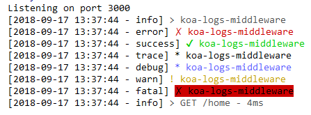
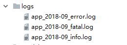

# koa-logs-middleware
koa2日志监控中间件模块

## 安装
```
npm install koa-logs-middleware 
```

## 说明
这个模块，可以在项目任何地方记录任何你想要的输出日志。输出内容可以自定。日志输出的时候会默认记录当前发生的时间和日志等级。                   
可以配置日志输出路径文件夹和日志文件名字, 超级简单的挂载方式如下：
```javascript
const koa = require('koa');
const app = new koa();
const logger = require('koa-logs-middleware');
app.use(logger({
    defaultPath: path.resolve(__dirname, 'logs'),
    applicationName: 'app'
}));
// 开发输入日志
app.use(async(ctx, next) => {
    const start = new Date();
    await next();
    const ms = new Date() - start;
    ctx.logger.info(`${ctx.method} ${ctx.url} - ${ms}ms`);
});
// 错误处理
app.on('error', (err, ctx) => {
    ctx.logger.error('server error', err, ctx)
});
```

日志输出到文档有三种日志等级：`info、error、fatal`           
除此之外的日志等级是不会记录到日志文件的。但是会输出到控制台。             
注册了日志之后，就直接把日志挂在到了ctx上下文，需要使用的地方可以直接呼出：
```javascript
router.get('/', (ctx) => {
    const returnObject = {
        name: 'yanle',
        age: 25
    };
    ctx.logger.debug('request Param: ',JSON.stringify(ctx.query));
    ctx.logger.debug('response: ', JSON.stringify(returnObject));
    ctx.body = returnObject;
});
```

## 相关api
有如下七种日志等级：
logger.info(*);                         
logger.error(*);                            
logger.success(*);                          
logger.trace(*);                            
logger.debug(*);                            
logger.warn(*);                         
logger.fatal(*);                            

这七种日志等级 都会输出到控制台，根据日志等级不同，会输出不同的颜色以作为区分，但是只有info、error和fatal会写入到日志输出文件中。其他的日志只会控制台打印出来。                 
                    
                    


如果想看更加完整的记录，可以转向这个项目： [static-server](https://github.com/yanlele/static-server)


