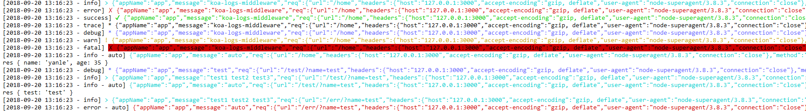

# koa-logs-middleware
koa2日志监控中间件模块

## 安装
```
npm install koa-logs-middleware 
```

## 说明
使用之前，请保证你的node版本>=8 ;                   
这个模块，可以在项目任何地方记录任何你想要的输出日志。输出内容可以自定。日志输出的时候会默认记录当前发生的时间和日志等级。                   
可以配置日志输出路径文件夹和日志文件名字, 超级简单的挂载方式如下：
```javascript
const koa = require('koa');
const app = new koa();
const logger = require('koa-logs-middleware');
app.use(logger({
    defaultPath: path.resolve(__dirname, 'logs'),
    applicationName: 'app',
    auto: true
}));
// 开发输入日志
app.use(async(ctx, next) => {
    const start = new Date();
    await next();
    const ms = new Date() - start;
    ctx.logger.info(`${ctx.method} ${ctx.url} - ${ms}ms`);
});
// 初始化路由中间件
app
    .use(routing.routes())
    .use(routing.allowedMethods({
        throw: true
    }));
```

日志输出到文档有三种日志等级：`info、error、fatal`           
除此之外的日志等级是不会记录到日志文件的。但是会输出到控制台。             
注册了日志之后，就直接把日志挂在到了ctx上下文，需要使用的地方可以直接呼出：
```javascript
router.get('/', (ctx) => {
    const returnObject = {
        name: 'yanle',
        age: 25
    };
    ctx.logger.debug('test');
    ctx.logger.debug('test1');
    ctx.body = returnObject;
});
```

添加更加详细和完备的日志记录信息:               
```
[2018-09-20 13:16:23 - info] > {"appName":"app","message":"koa-logs-middleware","req":{"url":"/home","headers":{"host":"127.0.0.1:3000","accept-encoding":"gzip, deflate","user-agent":"node-superagent/3.8.3","connection":"close"},"method":"GET","ip":"::ffff:127.0.0.1","protocol":"http","originalUrl":"/home","request":{},"query":{}}}
[2018-09-20 13:16:23 - error] ✗ {"appName":"app","message":"koa-logs-middleware","req":{"url":"/home","headers":{"host":"127.0.0.1:3000","accept-encoding":"gzip, deflate","user-agent":"node-superagent/3.8.3","connection":"close"},"method":"GET","ip":"::ffff:127.0.0.1","protocol":"http","originalUrl":"/home","request":{},"query":{}}}
```
格式化展示如下：       
```json
{
	"appName": "app",
	"message": "koa-logs-middleware",
	"req": {
		"url": "/home",
		"headers": {
			"host": "127.0.0.1:3000",
			"accept-encoding": "gzip, deflate",
			"user-agent": "node-superagent/3.8.3",
			"connection": "close"
		},
		"method": "GET",
		"ip": "::ffff:127.0.0.1",
		"protocol": "http",
		"originalUrl": "/home",
		"request": {},
		"query": {}
	}
}
```
自动记录的日志会记录相应返回的数据，而且会自动记录到日志文件，下面是一个请求成功的示例：
```json
{
	"appName": "app",
	"message": "auto",
	"req": {
		"url": "/home",
		"headers": {
			"host": "127.0.0.1:3000",
			"accept-encoding": "gzip, deflate",
			"user-agent": "node-superagent/3.8.3",
			"connection": "close"
		},
		"method": "GET",
		"ip": "::ffff:127.0.0.1",
		"protocol": "http",
		"originalUrl": "/home",
		"request": {},
		"query": {}
	},
	"res": {
		"statusCode": 200,
		"headers": {
			"content-type": "application/json; charset=utf-8",
			"content-length": "25"
		},
		"response": {
			"name": "yanle",
			"age": 35
		}
	}
}
```
下面是一个error的示例：
```json
{
	"appName": "app",
	"message": "auto",
	"req": {
		"url": "/err/?name=test",
		"headers": {
			"host": "127.0.0.1:3000",
			"accept-encoding": "gzip, deflate",
			"user-agent": "node-superagent/3.8.3",
			"connection": "close"
		},
		"method": "GET",
		"ip": "::ffff:127.0.0.1",
		"protocol": "http",
		"originalUrl": "/err/?name=test",
		"request": {},
		"query": {
			"name": "test"
		}
	},
	"err": {
		"type": "Error",
		"message": "error",
		"stack": "Error: error\n    at router.get.ctx (E:/yanlele/webProject/node/koa-logs-middleware/example/route.js:31:11)\n    at dispatch (E:\\yanlele\\webProject\\node\\koa-logs-middleware\\node_modules\\koa-router\\node_modules\\koa-compose\\index.js:44:32)\n    at next (E:\\yanlele\\webProject\\node\\koa-logs-middleware\\node_modules\\koa-router\\node_modules\\koa-compose\\index.js:45:18)\n    at E:\\yanlele\\webProject\\node\\koa-logs-middleware\\node_modules\\koa-router\\lib\\router.js:346:16\n    at dispatch (E:\\yanlele\\webProject\\node\\koa-logs-middleware\\node_modules\\koa-router\\node_modules\\koa-compose\\index.js:44:32)\n    at E:\\yanlele\\webProject\\node\\koa-logs-middleware\\node_modules\\koa-router\\node_modules\\koa-compose\\index.js:36:12\n    at dispatch (E:\\yanlele\\webProject\\node\\koa-logs-middleware\\node_modules\\koa-router\\lib\\router.js:351:31)\n    at dispatch (E:\\yanlele\\webProject\\node\\koa-logs-middleware\\node_modules\\koa-compose\\index.js:42:32)\n    at log (E:/yanlele/webProject/node/koa-logs-middleware/lib/index.js:204:16)\n    at dispatch (E:\\yanlele\\webProject\\node\\koa-logs-middleware\\node_modules\\koa-compose\\index.js:42:32)\n    at bodyParser (E:\\yanlele\\webProject\\node\\koa-logs-middleware\\node_modules\\koa-bodyparser\\index.js:86:11)\n    at <anonymous>\n    at process._tickCallback (internal/process/next_tick.js:188:7)"
	}
}
```

## 相关api
有如下七种日志等级：
```
logger.info(*);                         
logger.error(*);                            
logger.success(*);                          
logger.trace(*);                            
logger.debug(*);                            
logger.warn(*);                         
logger.fatal(*); 
```                           

参数 | 含义
|:-|:-|
defaultPath|日志写入文件的目录的地址， 如果不配置这个参数，那么日志是不会写入文件的
applicationName|这个参数是执行写入文件的文件名抬头名字。如果不配置defaultPath参数，那么这个参数也是没有意义的
auto | 默认为false ，如果改为true, 可以让中间件自动帮我们记录每一条输入输出信息。


这七种日志等级 都会输出到控制台，根据日志等级不同，会输出不同的颜色以作为区分，但是只有info、error和fatal会写入到日志输出文件中。其他的日志只会控制台打印出来。                 
                    
       


## 更新日志             
0.1.0:                   
- 错误监听已经集成在了模块内部，可以不用在app入口加入错误监听了，如果有错误会自动捕获，打印到控制台和输出到日志                                        
- 添加更加详细和完备的日志记录信息
- 添加配置参数auto, 默认为false ，如果改为true, 可以让中间件自动帮我们记录每一条输入输出信息，同时输出到控制台。                      


如果想看更加完整的记录，可以转向这个项目： [static-server](https://github.com/yanlele/static-server)


